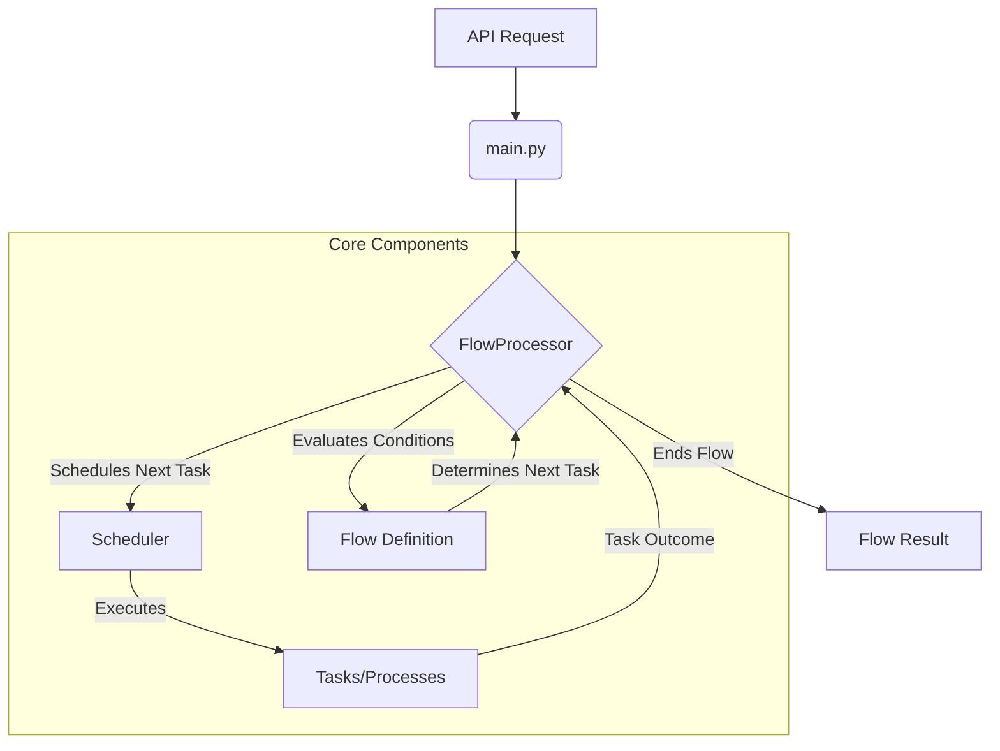

# Flow Manager

This project provides a system for defining and executing sequential workflows (flows). Flows are composed of tasks, and their execution path is determined by conditions based on task success or failure.

## Flow Manager Implementation Diagram

This diagram provides a simplified view of the flow manager's core components and their interactions.



## Flow Design

### Task Dependencies
Tasks are linked using `conditions`. Each condition specifies a `source_task`, its `outcome` (success/failure), and the `target_task_success` or `target_task_failure` to execute next. The `Flow` object defines the starting task and all available tasks and conditions.

### Task Success/Failure Evaluation
-   **Task Execution**: The `Process` class in `app/services/task.py` executes individual tasks and returns a success/failure status.
-   **Flow Progression**: The `FlowProcessor` in `app/services/flow.py` uses the task's outcome to find a matching `condition` and schedules the appropriate next task.

### Task Outcome Handling
-   **Success**: If a task succeeds, the flow proceeds to the `target_task_success` defined in a matching condition.
-   **Failure**: If a task fails, the flow proceeds to the `target_task_failure` defined in a matching condition.
-   **Flow Termination**: A flow ends when:
    *   An "end" task is reached.
    *   A task completes, and no matching condition is found for its outcome.
    *   The flow is explicitly terminated.
    The final result includes the flow's status and a history of executed tasks.

## Code Implementation

The flow manager is built with Python and FastAPI.

### Key Components:
-   **`app/models/flow.py`**: Defines data structures for tasks, conditions, and flows.
-   **`app/services/task.py`**: Handles individual task execution (`Process`) and scheduling (`Scheduler`).
-   **`app/services/flow.py`**: Orchestrates the overall flow execution (`FlowProcessor`), managing task transitions based on conditions.
-   **`app/main.py`**: The FastAPI application, responsible for loading flows from JSON files (in the `flows/` directory) and exposing API endpoints for creating, reading, and executing flows.

### Example Flow Definition (JSON):

Flows are defined in JSON files within the `flows/` directory.

```json
{
    "flow": {
        "id": "my-first-flow",
        "name": "My First Flow",
        "start_task": "task_a",
        "tasks": [
            {
                "name": "task_a",
                "description": "This is the first task."
            },
            {
                "name": "task_b",
                "description": "This is the second task."
            },
            {
                "name": "task_c",
                "description": "This is the third task."
            }
        ],
        "conditions": [
            {
                "name": "condition_a",
                "description": "If task_a succeeds, go to task_b",
                "source_task": "task_a",
                "outcome": "success",
                "target_task_success": "task_b",
                "target_task_failure": "task_c"
            },
            {
                "name": "condition_b",
                "description": "If task_b succeeds, go to task_c",
                "source_task": "task_b",
                "outcome": "success",
                "target_task_success": "task_c",
                "target_task_failure": "end"
            },
            {
                "name": "condition_c",
                "description": "If task_c succeeds, go to end",
                "source_task": "task_c",
                "outcome": "success",
                "target_task_success": "end",
                "target_task_failure": "end"
            }
        ]
    }
}
```

## Getting Started

This section guides you through setting up and running the Flow Manager project.

### Prerequisites

*   **Git**: Ensure Git is installed on your system.
*   **Python**: Ensure Python is installed.
*   **uv**: `uv` is a fast Python package installer and Python version manager. If you don't have it installed, you can install it following the installation [link](https://docs.astral.sh/uv/getting-started/installation/).

### Project Setup

1.  **Clone the Repository**:
    Clone the project repository to your local machine.
    ```bash
    # If the repository is not yet cloned
    git clone https://github.com/Akash98Sky/flow-manager.git
    cd flow-manager
    ```

2.  **Install Project Dependencies**:
    Use `uv` to install the project's dependencies. This command reads the `pyproject.toml` and `uv.lock` files to ensure all necessary packages are installed.
    ```bash
    uv sync
    ```

### Running the Application

Once the dependencies are installed, you can run the FastAPI application:

```bash
# Run the FastAPI application using uv
uv run fastapi dev
```
